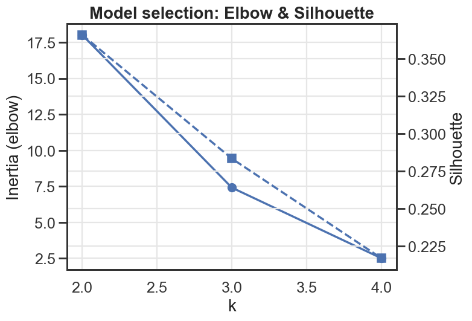
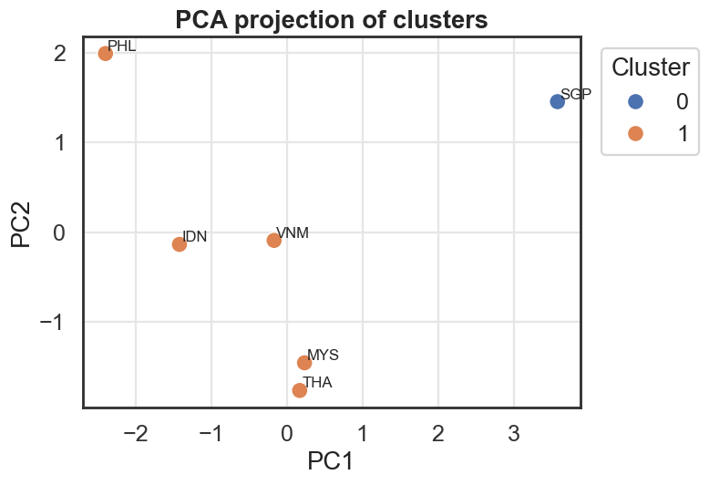
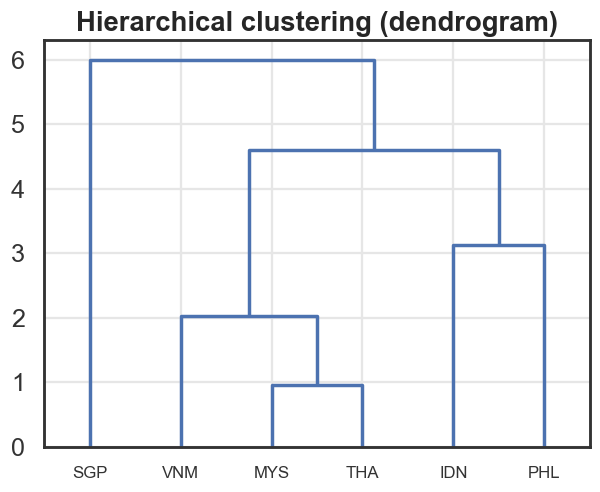
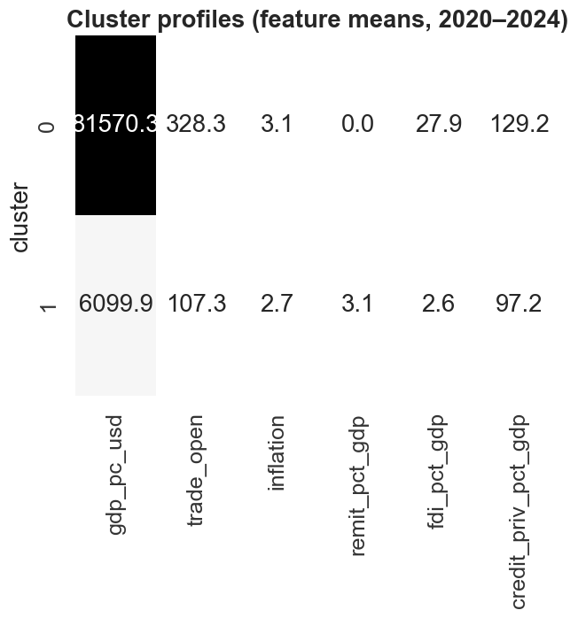

# ASEAN-6 Economic Clustering (2010–2024)

Minimal, reproducible pipeline to cluster ASEAN-6 economies (PH, ID, MY, TH, VN, SG) using World Bank indicators.

## What this repo shows
- Data pulled via `wbgapi`
- Feature engineering: tidy → 2020–2024 means → impute (median) → scale (z-score)
- Model selection with elbow + silhouette
- K-Means clustering + hierarchical dendrogram
- Clean visuals (minimalist style) and an auto-generated summary

## Indicators
- GDP per capita (US$): `NY.GDP.PCAP.CD`
- Trade openness (% GDP): `NE.TRD.GNFS.ZS`
- Inflation, CPI (annual %): `FP.CPI.TOTL.ZG`
- Personal remittances received (% GDP): `BX.TRF.PWKR.DT.GD.ZS`
- FDI net inflows (% GDP): `BX.KLT.DINV.WD.GD.ZS`
- Domestic credit to private sector (% GDP): `FS.AST.PRVT.GD.ZS`

## How to run
```bash
python -m venv .venv
source .venv/bin/activate
pip install -r requirements.txt

python src/fetch.py                # fetch World Bank data
python -m src.features             # tidy, aggregate, scale
python -m src.cluster              # choose k, fit, save figures
python -m src.report               # write reports/clusters_summary.md
## Figures




